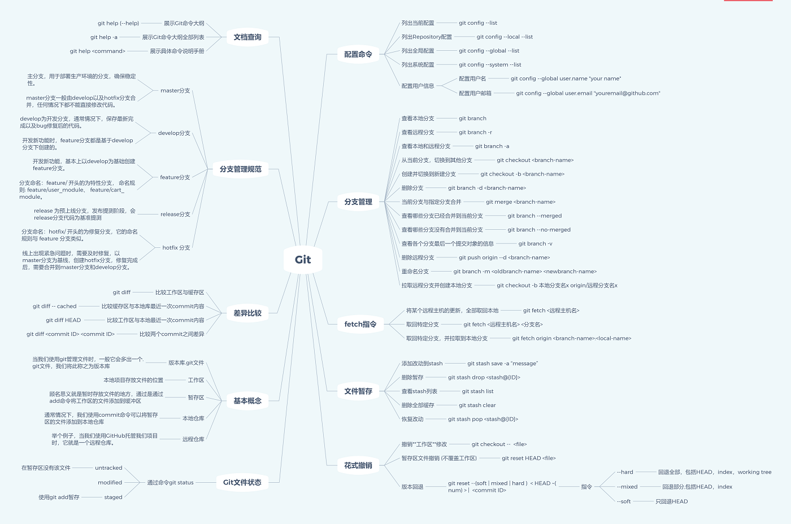

# git基本操作

## 版本控制初始化

> git init 

项目代码文件中会生成 .git 文件，称之为版本库，自动创建master分支，并且将HEAD指针指向master分支

## 配置基础信息

可分为：仓库级（--local）， 全局(用户)级（--global），系统级（--system），优先级依次降低

- 仓库：当前仓库目录下 .gitconfig
- 全局：用户名目录下 .gitconfig
- 系统：git安装目录下 .gitconfig

查看方式：

> 这种文件一般是被隐藏的，如果需要查看mac上 command+shift+ '.' 即可查看

查看配置信息：

> git config --[local|global|system] --list 

如果使用的是vscode，强烈推荐"git-autoconfig"插件；

## git代码区

- 工作区：写代码的地方

- 暂存区：写完代码，**git add .**将文件添加到暂存区，从此不用担心**ctrl+z/git checkout .**代码撤销了

- 本地仓库：使用**git commit -m 'feat: some msg'**将代码提交到本地仓库

- 远程仓库：使用**git push**将代码添加到远程仓库（git/gitlab/....）

## 分支管理

### 查看分支

- 所有分支 git branch -a
- 本地分支 git branch
- 远程分支 git branch -r

### 分支处理

- 单纯的切分支 

  > git checkout featture_name

- 创建并且切换分支 

  >git checkout -b feature_name

- 删除本地/远程分支

  > git branch -d feature_name

  > git push origin -d feature_name

- 分支重命名

  > git branch -m oldbranch-name newbranch-name

- 拉取远程分支

  > git checkout -b 本地分支名x origin/远程分支名x 

  // 另外一种方式,也可以完成这个操作。

  > git fetch origin branch-name:local-branch-name
   
- 分支合并

  > git merge/rebase

### rebase/merge的区别？

// TODO:

## 撤销操作

- 如果修改一些文件，但是又不想进行保存或者提交；丢弃单个文件
> git checkout fileName

如果想丢弃所有的文件，
>git checkout .

- 如果发现之前的代码提交错了分支，想回退

> git reset --[soft|hard] HEAD~n

## 文件暂存

在项目开发时，经常会遇到开发了一些功能，需要切换分支去修改另一个分支上的紧急bug；有两种方式可以解决这个问题。

- 方案一：创建一个本地新分支，将更改提交，然后在合并

- 方案二：git stash的使用

> git stash save 'feat: somemsg'

git stash 可以同时使用多次，使用 **git stash list** 查看多条记录；每条记录可以通过stash@(id)区分；

如果在多次操作的时候发现其中一次的暂存是不想保存的，可使用**git stash drop stash@{id}**

如果想清除所有的存储记录 **git stash clear**;

恢复自己想要的 **git stash pop stash@{id}**

## 查看/操作仓库信息

查看仓库地址

> git remote -v 

仓库关联

> git remote add origin 

参考：[git基本操作](https://www.cnblogs.com/evaling/p/9159047.html) , [一劳永逸,一张脑图带你掌握Git命令](https://juejin.im/post/6869519303864123399#heading-5)