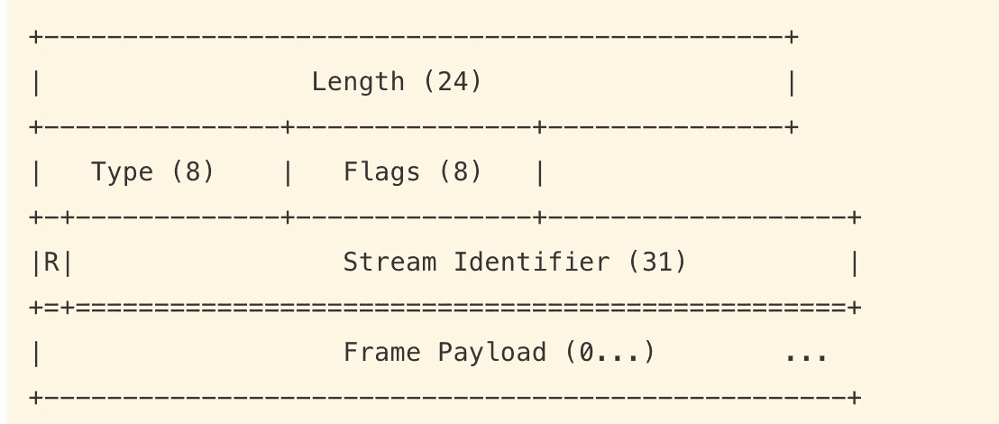
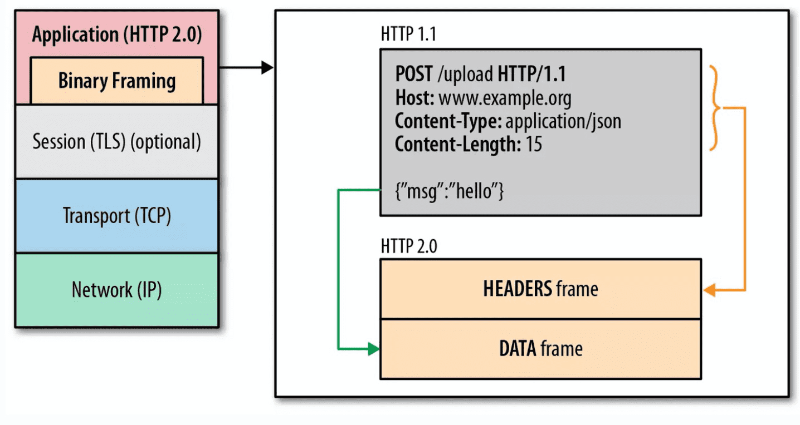

# http2新功能

http2是一个二进制协议，http1.1是文本协议

### http2多路复用 (Multiplexing)

多路复用允许**同时**通过单一的 HTTP/2 连接**发起多重**的请求-响应消息。
在 HTTP/1.1 协议中 「浏览器客户端在同一时间，针对同一域名下的请求有一定数量限制，超过限制数目的请求会被阻塞；并且一个http链接同一时间只支持单个请求；即使是管道化在服务器响应的时候也是串行的，并未做到真正意义的并行。

每个 Frame Header 都有一个 Stream ID 就是被用于实现该特性。**每次请求/响应使用不同的 Stream ID**。

HTTP/2 可以很容易的去实现多流并行而不用依赖建立多个 TCP 连接，并行地在同一个 TCP 连接上双向交换消息。

### 二进制分帧

在应用层和传输层之间增加一个**二进制分帧层**，在二进制分帧层中所有的传输信息都会被分割为更小的帧，并采用二进制格式编码，每个帧都有数据流的唯一标识，这样在数据帧到达目的主机时候，再按照数据流标识进行重组。

每个帧的格式基本如下：

- Length：表示Frame payload的长度
- type：用于区分这个帧属于HTTP Header还是HTTP body
- stream_identifier：当客户端和服务端建立TCP链接时，就会先发送一个 Stream ID = 0的流，用来做些初始化工作。之后客户端和服务端从 1 开始发送请求/响应，
  用于表示每个数据帧属于那个流

Frame 由 Frame Header 和 Frame Payload 两部分组成。不论是原来的 HTTP Header 还是 HTTP Body，在 HTTP/2 中，都将这些数据存储到 Frame Payload，组成一个个 Frame，再发送响应/请求。通过 Frame Header 中的 Type 区分这个 Frame 的类型。由此可见语义并没有太大变化。

### 优先级和依赖性

每个流都包含一个优先级（也就是“权重”），它被用来告诉对端哪个流更重要。
当资源有限的时候，服务器会根据优先级来选择应该先发送哪些流。
借助于PRIORITY帧，客户端同样可以告知服务器当前的流依赖于其他哪个流。该功能让客户端能建立一个优先级“树”，所有“子流”会依赖于“父流”的传输完成情况。

### 首部压缩（Header Compression）

随着页面资源的个数增加，cookies和请求的大小都会增加，有必要对其进行压缩。

http1.1不支持http首部压缩，为此SPDY和HTTP/2应运而生，而HTTP2使用的是[HPACK](http://http2.github.io/http2-spec/compression.html)算法, SPDY使用的是[DEFLATE](https://link.zhihu.com/?target=https%3A//en.wikipedia.org/wiki/DEFLATE)算法

SPDY是谷歌公司开源的一个对HTTP1.1优化的项目，http2摄取了其很多优点。（首部压缩算法不同）

**HPACK压缩算法的原理**

static table：
使用一份索引表来带定义**常用的HTTP Header**，请求的时候只需要发送在表里的索引位置即可。完整的索引表可参考[static table](http://http2.github.io/http2-spec/compression.html#rfc.section.A)

Dynamic Table：
每次请求还可以在表的末尾动态追加新的 HTTP Header 缓存。动态部分称之为 Dynamic Table。

HPACK不仅仅是通过索引值来降低请求头部数据量，同时还会将字符串进行**霍夫曼编码**来压缩字符串大小

[哈夫曼编码的理解(Huffman Coding)](https://zhuanlan.zhihu.com/p/75048255)
[哈夫曼压缩算法](https://www.cnblogs.com/daoluanxiaozi/archive/2011/12/26/2302464.html)

### 服务端推送（缓存推送）

当一个客户端请求资源X时候，服务器知道他很有可能也需要资源Z，于是服务器可以在客户端请求之前主动将资源Z推送给客户端，客户端将其放进缓存以备将来之需。

当服务端需要主动推送某个资源时，便会发送一个 Frame Type 为 PUSH_PROMISE 的 Frame，里面带了 PUSH 需要新建的 Stream ID。意思是告诉客户端：接下来我要用这个 ID 向你发送东西，客户端准备好接着。客户端解析 Frame 时，发现它是一个 PUSH_PROMISE 类型，便会准备接收服务端要推送的流

服务器推送需要客户端显式的允许服务器提供该功能。

### 流量控制

每个http2流都拥有自己的**公示的流量窗口，它可以限制另一端发送数据**。
对于每个流来说，两端都必须告诉对方自己还有足够的空间来处理新的数据，而在该窗口被扩大前，另一端只被允许发送这么多数据。

而只有数据帧会受到流量控制。

[HTTP/2 新特性浅析](http://io.upyun.com/2015/05/13/http2/)

[HTTP/2 相比 1.0 有哪些重大改进？](https://www.zhihu.com/question/34074946)

[http2 gitbook]https://ye11ow.gitbooks.io/http2-explained/content/part3.html
