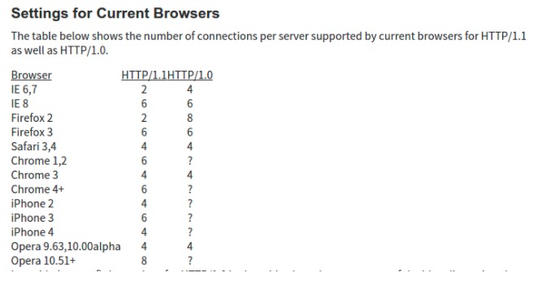

# http2与http1.1, http3的不同

## http2与http1.1不同

### http2多路复用 (Multiplexing)

多路复用允许**同时**通过单一的 HTTP/2 连接**发起多重**的请求-响应消息。
在 HTTP/1.1 协议中 「浏览器客户端在同一时间，针对同一域名下的请求有一定数量限制，超过限制数目的请求会被阻塞；并且一个http链接同一时间只支持单个请求。

HTTP/2 可以很容易的去实现多流并行而不用依赖建立多个 TCP 连接，并行地在同一个 TCP 连接上双向交换消息。

### 二进制分帧

在应用层和传输层之间增加一个二进制分帧层，在二进制分帧层中所有的传输信息都会被分割为更小的消息和帧，并采用二进制格式编码。

### 首部压缩（Header Compression）

http1.1不支持http收不压缩，为此SPDY和HTTP/2应运而生，而HTTP2使用的是[HPACK](http://http2.github.io/http2-spec/compression.html)算法, SPDY使用的是[DEFLATE](https://link.zhihu.com/?target=https%3A//en.wikipedia.org/wiki/DEFLATE)算法

### 服务端推送

http请求是怎么保证每个请求不会乱序的？？

https://www.zhihu.com/question/34074946

https://ye11ow.gitbooks.io/http2-explained/content/part3.html

https://zhuanlan.zhihu.com/p/26559480