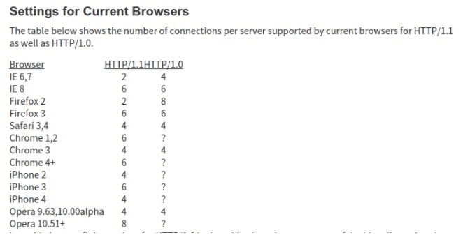

# http2与http1.1, http3的不同

## http2与http1.1不同

http2是一个二进制协议，http1.1是文本协议

### http2多路复用 (Multiplexing)

多路复用允许**同时**通过单一的 HTTP/2 连接**发起多重**的请求-响应消息。
在 HTTP/1.1 协议中 「浏览器客户端在同一时间，针对同一域名下的请求有一定数量限制，超过限制数目的请求会被阻塞；并且一个http链接同一时间只支持单个请求。

HTTP/2 可以很容易的去实现多流并行而不用依赖建立多个 TCP 连接，并行地在同一个 TCP 连接上双向交换消息。

### 二进制分帧

在应用层和传输层之间增加一个**二进制分帧层**，在二进制分帧层中所有的传输信息都会被分割为更小的帧，并采用二进制格式编码，每个帧都有数据流的唯一标识，这样在数据帧到达目的主机时候，再按照数据流标识进行重组。

### 优先级和依赖性

每个流都包含一个优先级（也就是“权重”），它被用来告诉对端哪个流更重要。
当资源有限的时候，服务器会根据优先级来选择应该先发送哪些流。
借助于PRIORITY帧，客户端同样可以告知服务器当前的流依赖于其他哪个流。该功能让客户端能建立一个优先级“树”，所有“子流”会依赖于“父流”的传输完成情况。

### 首部压缩（Header Compression）

http1.1不支持http收不压缩，为此SPDY和HTTP/2应运而生，而HTTP2使用的是[HPACK](http://http2.github.io/http2-spec/compression.html)算法, SPDY使用的是[DEFLATE](https://link.zhihu.com/?target=https%3A//en.wikipedia.org/wiki/DEFLATE)算法

随着页面资源的个数增加，cookies和请求的大小都会增加，

### 服务端推送（缓存推送）

当一个客户端请求资源X时候，服务器知道他很有可能也需要资源Z，于是服务器可以在客户端请求之前主动将资源Z推送给客户端，客户端将其放进缓存以备将来只需。

服务器推送需要客户端显式的允许服务器提供该功能。

### 流量控制

每个http2流都拥有自己的公示的流量窗口，它可以限制另一端发送数据。
对于每个流来说，两端都必须告诉对方自己还有足够的空间来处理新的数据，而在该窗口被扩大前，另一端只被允许发送这么多数据。

而只有数据帧会受到流量控制。

http请求是怎么保证每个请求不会乱序的？？

https://www.zhihu.com/question/34074946

https://ye11ow.gitbooks.io/http2-explained/content/part3.html

https://zhuanlan.zhihu.com/p/26559480