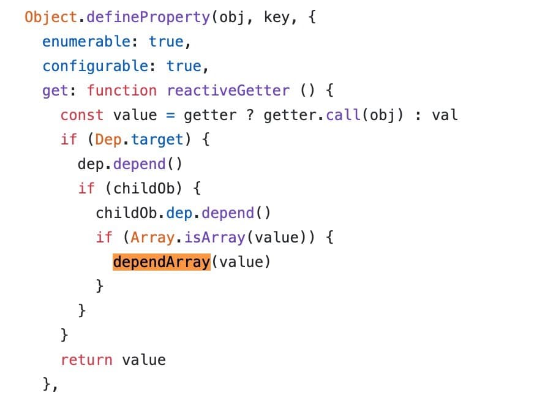

# vue知识点

## 简单说下mvc, mvvm 

- mvc 

mvc这种设计模式来源于后端开发，v（view）用于控制视图结构展示，c（controller）用于对接视图的响应,业务逻辑处理，m（model）用于数据库数据处理；对应到前端m的作用发生了改变，在前端m主要负责数据模型变化响应到view；
mvc的所有通信都是单向的。至于angularjs是mvc的说法都

- mvvm

v（view）视图的变更会触发vm（viewModel）的监听事件去修改数据模型model；model的数据更改会触发vm的数据绑定进而驱动v的更新。


## vue响应式数据原理

组件data中定义的属性，在组件初始化的时候会对data进行深层遍历，对每一个属性使用Object.defineProperty执行getter/setter转化，
每一个属性都有一个watcher实例，会在渲染过程中为数据属性记录依赖，如果属性值发生改变则会触发setter函数，依赖数组执行notify函数通知watcher，watcher会执行相关compiler函数进而触发关联组件的重新渲染。

[深入理解vue响应式原理](https://cn.vuejs.org/v2/guide/reactivity.html#ad)

[我的第一个vue实现-evel-vue](https://github.com/Arrayeval/evel-vue/tree/master/vue-coding)

使用Object.defineProperty写一个简单的双向绑定

```
<input type="text" id='nameEl'>
<span id='nameShow'></span>  
<script>
  var obj = {};
  Object.defineProperty(obj, 'name', {
    set: function(newVal) {
      document.getElementById('nameEl').value = newVal;
      document.getElementById('nameShow').innerHTML = newVal;
    }
  });

  document.addEventListener('keyup', function(e) {
    obj.name = e.target.value;
  })
</script>
```
使用proxy实现一个简单的双向绑定

```
<input type="text" id='nameEl'>
<span id='nameShow'></span>  
<script>
  var obj = {};
  
  let infoData = new Proxy(obj, {
    set: function(obj, prop, value) {
      document.getElementById('nameEl').value = newVal;
      document.getElementById('nameShow').innerHTML = newVal;
    }
  })

  document.addEventListener('keyup', function(e) {
    obj.name =  e.target.value;
  })
</script>
```

## vue如何检测数组的变化

上面已经讲解了vue使用Object.defineProperty对对象属性进行了数据劫持添加setter方法，实现响应式是数据的过程；对于数组这种特殊的数据类型是不能通过上面的方法实现的。

**具体实现思路：** 

1. 对数组的每个元素添加数据依赖




因此vue提供了几个数组的编译方法：

> push(), pop(), shift(), unshift(), splice(), sort(), reverse()

在vue中对这几个方法做了特殊处理，

```
const methodsToPatch = [
  'push',
  'pop',
  'shift',
  'unshift',
  'splice',
  'sort',
  'reverse'
];
methodsToPatch.forEach(function (method) {
  // cache original method
  const original = arrayProto[method]
  def(arrayMethods, method, function mutator (...args) {
    const result = original.apply(this, args)
    const ob = this.__ob__
    let inserted
    switch (method) {
      case 'push':
      case 'unshift':
        inserted = args
        break
      case 'splice':
        inserted = args.slice(2)
        break
    }
    if (inserted) ob.observeArray(inserted)
    // notify change
    ob.dep.notify()
    return result
  })
})
```
[vue重新定义数组变异方法的源码](https://github.com/vuejs/vue/blob/52719ccab8fccffbdf497b96d3731dc86f04c1ce/src/core/observer/array.js)

对比与对象处理过程的不同点，只是在数据劫持处理这点有所不同，对象属性改变会触发setter方法进而触发依赖数组的notify方法，再触发watcher去执行complile函数更新对应的组件视图；对于数组是通过变异方法去更新数组，进而触发依赖数组的notify方法，再触发watcher去执行complile函数更新对应的组件视图。

**data是一个返回对象的函数，为什么要这样设计？**

- 每一次都返回一个新的data对象，避免同一个组件多次使用时数据相互影响。(同一个页面使用某个组件多次)

- 如果是是一个对象也方便vue去做数据劫持

**为什么改变数组length，或者通过下标增加新值，或者为已经初始化的对象通过".value"形式增加一个新属性不会触发视图的更新？**

原因就是没有触发dep.notify()，不能通知到watcher去执行更新视图相关操作。因此为了能使得数据更新驱动视图的更新我们必须要触发对象属性的setter方法，或者对数组使用变异方法。

```
// 重新赋值触发setter方法
vm.userProfile = Object.assign({}, vm.userProfile, {
  age: 27,
  favoriteColor: 'Vue Green'
})

// 重新赋值触发setter方法
arr = [1,2,3,4]; 
// 或者 使用变异方法
arr.push(4);
```

##  讲讲vue观察者模式和发布订阅者模式的具体实现


## vue中异步渲染，以及异步渲染的原因

> vue在更新dom的时候是异步执行的，只要监听到数据变化，vue将开启一个队列，并缓冲在同一事件循环中发生的所有数据变更，如果同一个watcher被触发多次只会推入到队列一次；如果数据没有发生改变是不会触发watcher的；这样做的目的是为了减少不必要的计算和DOM操作；当刷新队列时组件会在下一个事件循环“tick”中更新。

一个帮助分析的例子：
```
<template>
 <div>
   <div ref="message">{{message}}</div>
   <button @click="fn">点击</button>
 </div>
</template>

export default {
  data () {
    return {
      message: 123
    };
  },
  methods () {
    fn () {
      this.message = 456;
      console.log(this.$refs.message.innerHTML);
      this.$nextTick(function(){ //或者Vue.nextTick
        console.log(this.$refs.message.innerHTML);
      });
    }
  }
}
```
> 结果分析：123， 456

产生以上的原因vue异步渲染导致的

## nextTick的作用

用法：在下次DOM更新循环结束之后执行延迟回调。在修改数据之后立即使用这个方法，获取更新后的DOM。

使用场景：常见与数据更新之后立即获取DOM的案例，created中获取dom节点。

> Vue 在内部尝试对异步队列使用原生的Promise.then 和MutationObserver，如果执行环境不支持，会采用setTimeout(fn, 0)代替。

[nextTick的源码](<https://github.com/vuejs/vue/blob/d7d8ff06b70cf1a2345e3839c503fdb08d75ba49/src/core/util/next-tick.js>)

## vue组件生命周期，以及各做了什么事情


**new vue** 

生成vue实例

**beforeCreate**

生成$options选项，给实例添加生命周期相关属性

**created**

从$options获取数据选项，遍历methods选项，给数据添加依赖，定义getter，setter属性；这个阶段可以访问到data属性，使用methods。

**beforeMount**

将HTML解析成AST节点，根据AST节点生成渲染树，render函数首次被调用。

**mounted**

执行render函数生成虚拟DOM，创建真实dom替换虚拟dom并挂载实例，此时可以操作dom。

**beforeUpdate** 

data数据更新之后，虚拟dom重新渲染之前被调用，此时修改data不会附加渲染过程。

**updated** 

虚拟dom重新渲染之后被调用，此时修改data会触发死循环。

**beforeDestory**

组件实例销毁之前被调用。

**destroyed**

实例销毁之后调用，清除事件监听。

分别在每个生命beforeCreate, created, beforeMount, mounted阶段执行下面的输出

```
console.log(this)
console.log(this.$data)
console.log(this.$el)
```


[源码](https://github.com/vuejs/vue/blob/dev/src/core/instance/lifecycle.js)

[每个生命周期做了什么](https://blog.csdn.net/weixin_34050005/article/details/87964047)


