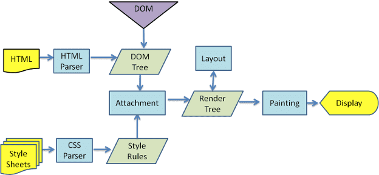
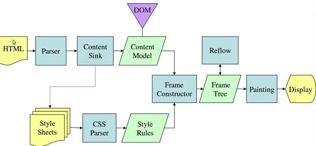
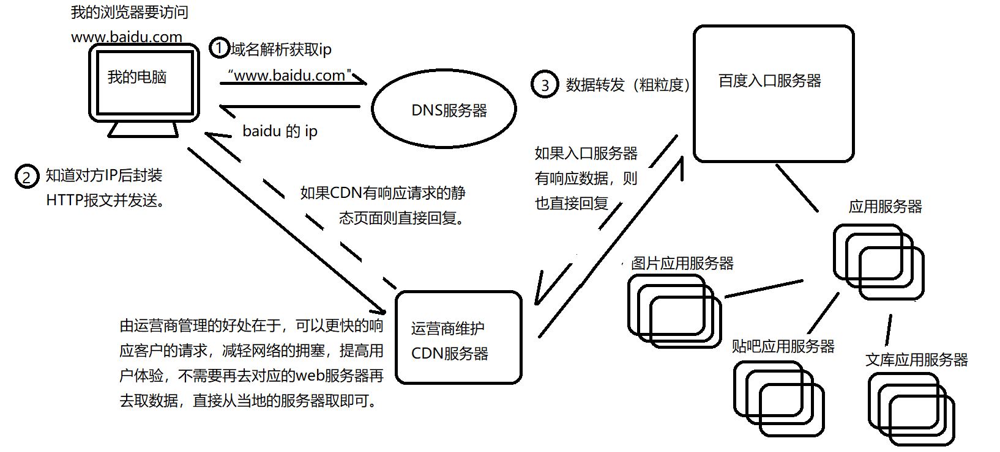

# 关于网页优化的几点

1. 网页渲染的过程
2. 影响网页加载速度的因素
3. 针对性优化的几点

## 网页渲染的过程

大致步骤：

1. 用户输入URL地址
2. 浏览器DNS域名解析，从URl获取主机名与端口号（
  浏览器先查找本地DNS缓存列表 没有的话 再向浏览器默认的DNS服务器发送查询请求 同时缓存）
3. 浏览器建立一条与目标Web服务器的TCP连接
4. 浏览器向服务器发送一条HTTP请求报文
5. 服务器向浏览器返回一条HTTP响应报文
6. 关闭连接 浏览器解析文档
7. 如果文档中有资源 重复3 4 5动作直至资源全部加载完毕

**问题一：** 至于拿到资源之后浏览器怎么处理?

不同的浏览器内核不同渲染方式：

**第一种：**

**第二种：weblit渲染流程**

看完上面的过程大致可以总结出以下的几个过程

**结论：**

- HTML解析出DOM Tree
- CSS解析出css tree
- 将二者关联生成Render Tree
- Layout 根据Render Tree计算每个节点的信息
  - 创建渲染树之后，就是布局（回流），通过渲染树中的渲染对象信息计算出一个对象的位置与尺寸安置在页面的正确位置。衍生出一个概念回流
- Painting 根据计算好的信息绘制整个页面
  - 在绘制阶段，系统会遍历呈现树，并调用呈现器的“paint”方法，将呈现器的内容显示在屏幕上。 衍生出一个概念重绘

针对以上的过程常见的两个问题？

1. css加载会阻塞网页的渲染吗？
> 会，因为css会形成css tree最终与dom tree一起渲染成render tree
2. js的加载会阻塞网页的渲染吗？ 
> 会，上图没有体现出来，因为js资源的加载会阻塞dom tree的形成（JS可能会改动DOM和CSS，所以继续解析会造成浪费）,这也是为什么会有将js资源script标签放在body之后优化手段，以及[script的defer,asyn存在的意义](<https://www.cnblogs.com/evaling/p/10677566.html>)。

## 针对网页实现过程，我们可以做出以下的优化实践技巧：
- HTML文档结构层次尽量少，简单，少些无用的标签
  - 因为会加长html的解析，影响domTree的形成时间
- script脚本尽量放在body之后
  - js资源的加载会阻塞html的渲染
- 样式结构层次尽量简单
  - 存在一个问题（sccs,less这种嵌套语法会影响加载时间吗？）
- 减少dom操纵，避免回流
  - 在频繁操作某个dom元素时，可以利用dom碎片或者可以将这个元素先display:none或者隐藏起来（减少重绘的可能性）
- 动画
  尽量使用transform来代position:absolute，GPU硬件加速
- 使用服务器ssr渲染（next.js/nuxt.js）,让代码在服务器先执行一次，使得用户下载的HTML已经包含了所有页面展示的内容，减少了浏览器解析html生成页面的这个费时间的过程

## 针对网页资源下载，我们可以可以做什么优化呢？

这个过程包括的浏览器获取资源的信息，也就是输入域名到浏览器返回资源信息之间的这个过程。

**首先先了解下整个过程是怎么样的？**

1. 域名解析完之后，浏览器与服务器建立TCP连接(三次握手)
2. 浏览器发送请求到服务器
3. 服务器做出响应数据转发

  

> 大致过程就是:浏览器解析域名，发送请求与服务器建立tcp链，接服务器返回资源

这个过程中我们可以很容易察觉到几个比较费时间的点？

- 浏览器与服务器频繁的建立链接（三次握手）
- 浏览器针对于Http1下载资源的策略限制
- 数据传输的时间消耗
- 资源文件包的太大 

**浏览器与服务器频繁建立连接**

建立连接是一个比较费时间的过程，因此使用持久连接(每个连接可以处理多个请求-响应事务,Http/1.1默认支持)，以及双工通信（webSocket）都是对这个问题的优化。

**关于http1下载资源策略的限制**

- http1.1的长链接

问题：虽然是一个长链接可以有效的减少频繁链接的时间消耗，但是对于连接中发送的多个请求的处理方式确实顺序执行，这样就会造成任务阻塞的问题。

 **优化方案一：** http2.0多路复用就是一个通道可以让多条线路同时占用而不会出现混乱，为每一个请求带一个编号，它样服务器方就能为请求的回应对上号了。如果一个请求时间过长，那么服务器就可以先暂停这个请求，先处理下一个请求，处理完再回来处理这个长请求，如果找回这个长请求，那就靠这个编号了。

 **优化方案二：** 或者减少http请求数量，例如资源合并，对应在前端的实际场景有
  - 图片资源的合并雪碧图
  - style-loader将css文件添加到html文件中
  - url-loader将符合大小的图片转化成base64的文件形式之间融合在css文件中或 者html文件中
  
 > 以上的第二点，第三点使用时候要权衡利弊，因为会增加首页渲染时间

**关于数据传输的时间消耗**

从浏览器的向服务器发送请求，再到服务器响应请求回送数据这是一个数据传输的过程，
这个数据传输的过程与物理距离有着十分大的关系，可以考虑使用CDN加速处理。

**针对资源包太大的问题**

现在的项目一般而言都是使用webpack来进行构建的，他提供了很多优化技巧：
- 代码压缩工具减少代码体积
- 开启生成模式的tree shaking去掉没有使用的代码
- 代码分割code spliting(路由分割)
- 懒加载（按需加载）

另外针对与资源文件体积的大小优化，还涉及到<a target='blank' href='/前端杂记/关于图片的优化.html'>图片资源的处理</a>

参考文章：
- [浏览器渲染页面过程与页面优化](https://segmentfault.com/a/1190000010298038#articleHeader7)

- [输入网址到资源获取的过程](https://www.cnblogs.com/shy0322/p/9276883.htmle)

- [什么是CDN，以及优势](<https://www.zhihu.com/question/36514327/answer/68143522>)

- [CDN能解决什么问题](<https://blog.csdn.net/chuwo0959/article/details/100618113>)

- [HTTP2.0与HTTP1.1的区别](<https://blog.csdn.net/xx666zz/article/details/85337472>)

- [二进制文件与文本文件的区别](<https://blog.csdn.net/dongchongyang/article/details/79044082>)

- [ssr技术存在的意义及讲解](<https://juejin.im/post/5bc7ea48e51d450e46289eab?utm_medium=hao.caibaojian.com&utm_source=hao.caibaojian.com>)

