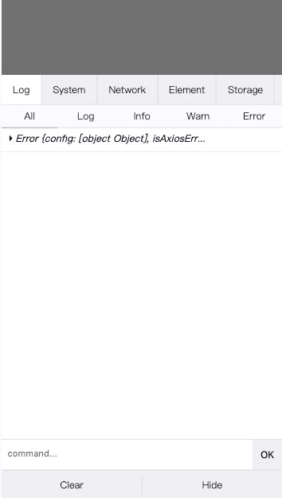

# 前端H5项目调试方法汇总

在做h5项目时，常常面临着一个影响开发效率的问题---前端调试。前端猿对webpack的热更新以及配合web浏览器的开发者工具（F12）所带来的开发体验而不能自拔。随着前端开发的工作范畴越来越广，前端猿的开发工作从之前的pc web开发已经慢慢扩充到手机H5开发（指的是在手机上打开的网页）。鉴于手机机型，系统版本以及浏览器的较多差别，我们有必要掌握一些H5的调试方式。

## vconsole让手机浏览器拥有开发者工具

vconsole使用方式十分简单，使用之后我们可以很轻松的在手机上查看各种资源加载情况以及资源请求。

**使用方式：**
- 安装
> npm install vconsole
- 引入
```
function createVconsole() {
  if (process.env.NODE_ENV === 'development' || getConfig().env === 'development') {
    let VConsole = require('vconsole');
    new VConsole();
  }
}
```
最终的效果可参考：



npm地址：[vconsole](<https://www.npmjs.com/package/vconsole>)

## spy-debugger强大的代理抓包及调试工具

spy-debugger是一个功能十分强大的代理工具，使用它我们可以在同一局域网查看资源load的情况，接口调用，以及调试H5界面元素。

**使用方式：**

- 安装
> npm install spy-debugger -g

- 启动
> spy-debugger

全局安装之后，执行 **spy-debugger**命令即可（不需要进入项目文件夹，因为它是代理手机的网络请求），具体其他功能可以参考它的npm说明。执行成功之后可以看到如下的信息：


- 手机代理设置

手机必须处于同一局域网，配置手机网络代理


- 在浏览器输入命令行显示的地址

> http://127.0.0.1:59258

- 如果是ios系统需要安装证书

设置好代理之后，打开浏览器访问 "https://s.xxx"这个奇怪的网址，会出现一个弹窗，点击允许安装，然后‘设置 - 通用 - 描述文件’。

最终的效果：

接口信息查看：

页面元素调试：


npm地址：[spy-debugger](<https://www.npmjs.com/package/spy-debugger>)

## 微信客户端

## safari链接手机调试iphone

## svrxjs

https://juejin.im/post/5dad208ef265da5b7d692340
https://docs.svrx.io/zh/quick-start.html
https://github.com/svrxjs/svrx