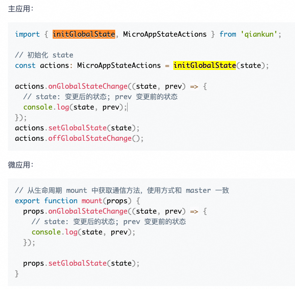
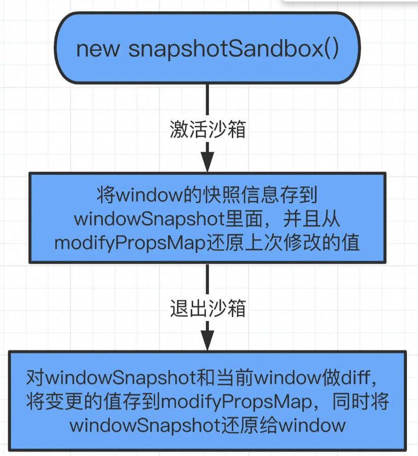
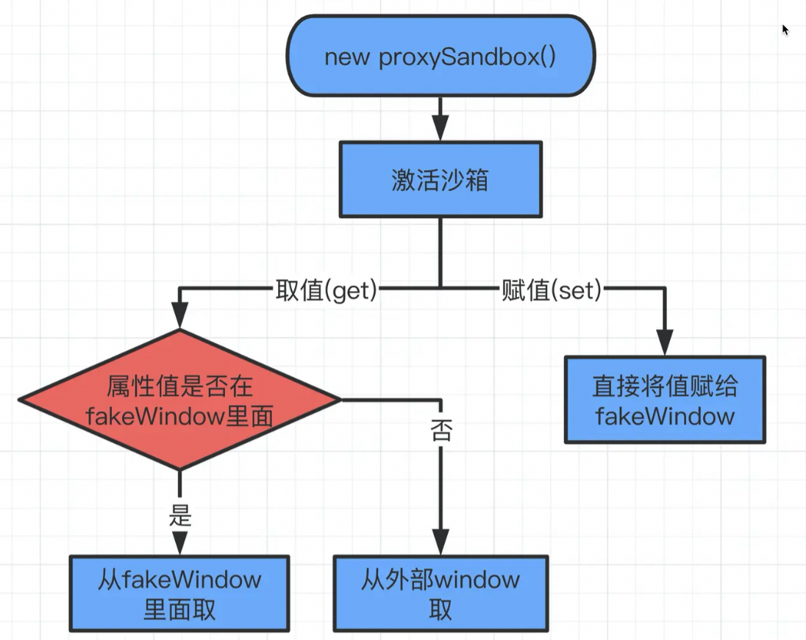

# 微前端方案有哪些？

他们是怎么解决下面这些问题的？

* 子应用的加载
* 应用间通信
* css&js的隔离

## [single-app](https://zh-hans.single-spa.js.org/docs/migrating-existing-spas/)

### 子应用的加载
 
1. 监听hashchange[hash模式], pushstate, popstate[history模式]方法
2. 当页面路径改动的时候，会触发上面的监听
3. 执行回调，激活子应用

### 应用间通信

customProps方案 可以是一个对象或者是一个函数，可用于主应用，子应用之间的通信
在主应用注册路由的时候，可以给每一个子应用定义一个customProps,作为参数传入mount方法

```
// 子应用路由注册表
const apps = [
  {
    // 子应用名称
    name: 'app1',
    // 子应用加载函数
    app: loadApp('http://localhost:8081', 'app1', [ "/js/chunk-vendors.js", "/js/app.js" ]),
    // 当路由满足条件时（返回true），激活（挂载）子应用
    activeWhen: location => location.pathname.startsWith('/app1'),
    // 传递给子应用的对象
    customProps: {}
  },
  {
    name: 'app2',
    app: loadApp('http://localhost:8082', 'app2', [ "/js/chunk-vendors.js", "/js/app.js" ]),
    activeWhen: location => location.pathname.startsWith('/app2'),
    customProps: {}
  }
]

// 注册子应用
for (let i = apps.length - 1; i >= 0; i--) {
  registerApplication(apps[i])
}

```

### css&js的隔离

官方没有提供方案

1. 不支持 Javascript 沙箱隔离，需要自己去使用single-spa-leaked-globals之类的库去隔离

2. 不支持css隔离，需要自己使用single-spa-css库或者postcss等去解决样式冲突问题无法预加载
  postcss-selector-namespace: 解决css的命名冲突

## [qiankun](https://qiankun.umijs.org/zh/api#initglobalstatestate)

> 基于single-app来做二次封装的

1. 提供了js沙箱和css隔离方案
2. HTML ENTRY的接入方式， 解析html, 从中分析js, css, 利用import-html-entry
3. 资源预加载, 优化方案就是利用window.requestIdleCallback在浏览器进程间隙去加载资源

### 子应用的加载

1. 拿到子应用的entry配置的链接
2. 通过fetch获取链接返回的html字符串
3. 解析html字符串
4. 拿到html模板
5. 通过fetch获取外联css内容，并插入到html模板中
6. 通过fetch获取外联js，并执行
7. 通过appendChild将html字符串插入到container配置的节点下

### 应用间通信

**initGlobalState(state)**



**实现原理：**

1. 设置两个全局变量，一个存储传递变量对象，一个记录回调【唯一标识global-${+new Date()}】
2. onGlobalStateChange 生成回调
3. setGlobalState 修改全局变量，通过emitGlobal触发回调
4. offGlobalStateChange 卸载该应用下的依赖

[实现源码](https://github.com/umijs/qiankun/blob/master/src/globalState.ts)

**简单实现**

```
import { isArray, warn } from './utils';
import { setCache, getCache } from './cache';

const eventNameSpace = 'event';

type StringSymbolUnion = string | symbol;

interface Hooks {
  emit(key: StringSymbolUnion, value: any): void;
  on(key: StringSymbolUnion, callback: (value: any) => void): void;
  off(key: StringSymbolUnion, callback?: (value: any) => void): void;
  has(key: StringSymbolUnion): boolean;
}

class Event implements Hooks {
  eventEmitter: object;

  constructor() {
    this.eventEmitter = {};
  }

  emit(key: StringSymbolUnion, ...args) {
    const keyEmitter = this.eventEmitter[key];

    if (!isArray(keyEmitter) || (isArray(keyEmitter) && keyEmitter.length === 0)) {
      warn(`event.emit: no callback is called for ${String(key)}`);
      return;
    }

    keyEmitter.forEach(cb => {
      cb(...args);
    });
  }

  on(key: StringSymbolUnion, callback: (value: any) => void) {
    if (typeof key !== 'string' && typeof key !== 'symbol') {
      warn('event.on: key should be string / symbol');
      return;
    }
    if (callback === undefined || typeof callback !== 'function') {
      warn('event.on: callback is required, should be function');
      return;
    }

    if (!this.eventEmitter[key]) {
      this.eventEmitter[key] = [];
    }

    this.eventEmitter[key].push(callback);
  }

  off(key: StringSymbolUnion, callback?: (value: any) => void) {
    if (typeof key !== 'string' && typeof key !== 'symbol') {
      warn('event.off: key should be string / symbol');
      return;

    }

    if (!isArray(this.eventEmitter[key])) {
      warn(`event.off: ${String(key)} has no callback`);
      return;
    }

    if (callback === undefined) {
      this.eventEmitter[key] = undefined;
      return;
    }

    this.eventEmitter[key] = this.eventEmitter[key].filter(cb => cb !== callback);
  }

  has(key: StringSymbolUnion) {
    const keyEmitter = this.eventEmitter[key];
    return isArray(keyEmitter) && keyEmitter.length > 0;
  }
}

let event = getCache(eventNameSpace);
if (!event) {
  event = new Event();
  setCache(eventNameSpace, event);
}

export default event;


export const getCache = (key: string): any => {
  const icestark: any = (window as any)[namespace];
  return icestark && icestark[key] ? icestark[key] : null;
};
```

### js的隔离

**沙箱分三个类型：**

#### snapshotSandbox快照沙箱
> 基于 diff 方式实现的沙箱，用于不支持 Proxy 的低版本浏览器

**原理**
- 快照版的沙箱是数据的备份，激活的时候复制window到快照，并将modifyPropsMap上的属性融合到window上
- 卸载的时候将快照恢复到window, 并将新增&改变的属性单独存储到一个对象modifyPropsMap上进行记录



**缺点**
- 会污染全局变量

**[实现源码](https://github.com/umijs/qiankun/blob/master/src/sandbox/snapshotSandbox.ts)**

**简单实现**
```
const iter = (window, callback) => {
  for (const prop in window) {
    if(window.hasOwnProperty(prop)) {
      callback(prop);
    }
  }
}
class SnapshotSandbox {
  constructor() {
    this.proxy = window;
    this.modifyPropsMap = {};
  }
  // 激活沙箱
  active() {
    // 缓存active状态的window
    this.windowSnapshot = {};
    iter(window, (prop) => {
      this.windowSnapshot[prop] = window[prop];
    });
    Object.keys(this.modifyPropsMap).forEach(p => {
      window[p] = this.modifyPropsMap[p];
    })
  }
  // 退出沙箱
  inactive(){
    iter(window, (prop) => {
      if(this.windowSnapshot[prop] !== window[prop]) {
        // 记录变更
        this.modifyPropsMap[prop] = window[prop];
        // 还原window
        window[prop] = this.windowSnapshot[prop];
      }
    })
  }
}
```

#### proxySandbox 代理沙箱[多例]
> 基于 Proxy 实现的沙箱，用于支持 Proxy 的浏览器

**原理**

1. 初始化的时候构造函数中，将window对象复制到fakeWindow
2. 使用proxy代理fakeWindow
3. 设值的时候，赋值给fakeWindow
4. 取值的时候，去判断如果fakeWindow上有该属性，则返回，否则去window上取值



**[源码](https://github.com/umijs/qiankun/blob/master/src/sandbox/proxySandbox.ts)**

**简单实现**

```
class ProxySandbox {
  globalWhitelistPrevDescriptor = {}; // init key 
  globalContext = window;
  active() {
    this.sandboxRunning = true;
  }
  inactive(){
    // reset to init value
    Object.keys(this.globalWhitelistPrevDescriptor).forEach(p => {
      const descriptor = Object.getOwnPropertyDescriptor(globalContext, p);
      if (descriptor) {
        Object.defineProperty(this.globalContext, p, descriptor);
      } else {
        delete this.globalContext[p];
      }
    })
    this.sandboxRunning = false;
  }

  constructor() {
    const fakeWindow = {};
    const proxy = new Proxy(fakeWindow, {
      set: (target, key, value) => {
        if(this.sandboxRunning) {
          if (globalVariableWhiteList.indexOf(key) !== -1) {
            this.globalWhitelistPrevDescriptor[key] = Object.getOwnPropertyDescriptor(globalContext, key);
          }
          target[key] = value;
          return true;
        }
      },
      get: (target, key) => {
        return target[key] || window[key];
      }
    });
    this.proxy = proxy;
  }
}

// 运行
window.testText = "ceshi001";

let proxy1 = new ProxySandbox();
let proxy2 = new ProxySandbox();
((window) => {
  proxy1.active();
  console.log("修改前proxy1", window.testText);
  window.testText = "ceshi002";
  console.log("修改后proxy1", window.testText);
})(proxy1.proxy)

((window) => {
  proxy1.active();
  console.log("修改前proxy2", window.testText);
  window.testText = "ceshi003";
  console.log("修改后proxy2", window.testText);
})(proxy2.proxy)
```
**优劣分析**

- 不污染全局变量，可以多个子应用通过存在，互不污染

### css的隔离

#### [shadowDom](https://developer.mozilla.org/zh-CN/docs/Web/API/Web_components/Using_shadow_DOM)

>影子 DOM（Shadow DOM）允许你将一个 DOM 树附加到一个元素上，并且使该树的内部对于在页面中运行的 JavaScript 和 CSS 是隐藏的。

**实现案例**

```
<html lang="en">
  <head>
    <meta charset="UTF-8">
    <title>样式隔离沙箱</title>
    <style>
      p {
          color: red;
      }
    </style>
  </head>
  <body>

  <div id="shadow-dom">
    <p>Shadow DOM 隔离</p>
  </div>
    
  <p>外部文本</p>
  
  <script src="./shadowDOMIsolation.js"></script>
  </body>
  </html>
```

- shadowDOMIsolation.js

```
const shadowDOMSection = document.querySelector('#shadow-dom');

const appElement = shadowDOMIsolation(`
  <div class="wrapper">
    <style>p { color: purple }</style>
    <p>内部文本</p>
  </div>
`);

shadowDOMSection.appendChild(appElement);

function shadowDOMIsolation(contentHtmlString) {
  contentHtmlString = contentHtmlString.trim();
  const containerElement = document.createElement('div');
  let shadow = '';
  if (containerElement.attachShadow) {
    // 兼容性更广的写法
    // 当 mode 设置为 "open" 时，页面中的 JavaScript 可以通过影子宿主的 shadowRoot 属性访问影子 DOM 的内部。
    shadow = containerElement.attachShadow({ mode: 'open' });
  } else {
    // 旧写法
    shadow = containerElement.createShadowRoot();
  }
  // 生成 shadow DOM 的内容
  shadow.innerHTML = contentHtmlString;

  return containerElement;
}
```

#### scoped css

**缺点**

- 弹窗样式会丢失，因为弹窗默认是挂载在body上的，不在子应用中，也就不在shadowDom中,所以样式回丢失！！【一般而言弹窗组件的遮罩层的定位是参照body去实现了，铺满整个屏幕】

- 基于路由匹配，无法同时激活多个子应用，也不支持子应用保活

- 改造成本较大，从代码、路由等等都要做一系列的适配（基准路由，子应用的注册）

## [iceStark](https://micro-frontends.ice.work/docs/guide/concept/workflow)

> iceStark实现方式和qiankun实现方式类型，做了删减

### 子应用的加载方式

1. index.html是公用的
2. 路由切换加载子应用的资源（css， js）
3. 切换页面内容


## [无界](https://wujie-micro.github.io/doc/)

> 无界微前端方案基于webcomponent容器 + iframe沙箱，能够完善的解决适配成本，样式隔离，运行性能，页面白屏，子应用通信
> 如果不支持webcomponent 可以降级为iframe的方式


**优点**

- 组件方式使用微前端，不注册，不改造路由
- 一个页面可以同时激活多个子应用，子应用使用iframe的路由，不用关心路由占用问题
- 天然的js沙箱，不会污染主应用环境

#### 几种模式

- 保活模式

子应用的 alive 设置为true时进入保活模式，内部的数据和路由的状态不会随着页面切换而丢失。

子应用只会切换一次，页面发生切换的时候dom的webComponent会保留在内存，当子应用重新激活时无界会将内存中的webcomponent重新挂载到容器上

- 单例模式

子应用的alive为false且进行了生命周期改造时进入单例模式。

如果主应用上有多个菜单栏用到了子应用的不同页面，在每个页面启动该子应用的时候将name设置为同一个，这样可以共享一个wujie实例，承载子应用js的iframe也实现了共享，不同页面子应用的url不同，切换这个子应用的过程相当于：销毁当前应用实例 => 同步新路由 => 创建新应用实例

切换这个子应用的过程相当于：销毁当前应用实例 => 同步新路由 => 创建新应用实例

- 重建模式

每次页面切换不仅会销毁承载子应用dom的webcomponent，还会销毁承载子应用js的iframe，相应的wujie实例和子应用实例都会被销毁

### 子应用的加载

1. 初始化wujie实例sandbox， 创建iframe
2. 阻止iframe的加载（iframeWindow.stop） 防止对子应用的污染
2. 通过importHTML，processTpl解析html，返回template , scripts, styles
3. getExternalScripts获取js， getExternalStyleSheets获取css【如果是通过cdn引入的，存在跨域的问题，需要设置子应用允许跨域】 
4. 使用插件对css进行处理，然后再放入 webcomponent的shadowDom中
5. 将js插入到iframe中， 并将window进行代理为iframe的window  

> shadowDom做到了样式的隔离，iframe做到了js的隔离

子应用的资源和接口的请求都在主域名发起，所以会有跨域问题，子应用必须做cors 设置
```
app.use((req, res, next) => {
  // 路径判断等等
  res.set({
    "Access-Control-Allow-Credentials": true,
    "Access-Control-Allow-Origin": req.headers.origin || "*",
    "Access-Control-Allow-Headers": "X-Requested-With,Content-Type",
    "Access-Control-Allow-Methods": "PUT,POST,GET,DELETE,OPTIONS",
    "Content-Type": "application/json; charset=utf-8",
  });
  // 其他操作
});
```

#### iframe 连接机制 和 css 沙箱机制
**css 沙箱机制：**

采用 webcomponent 创建一个 wujie 自定义元素来实现页面的样式隔离，将子应用的完整结构渲染在内部。

**iframe 连接机制：**

子应用的实例 instance 在 iframe 内运行，dom 在主应用容器下的 webcomponent 内，通过代理 iframe 的 document 到 webcomponent，可以实现两者的互联；将 document 的查询类接口（getElementsByTagName、getElementsByClassName、getElementsByName、getElementById、querySelector、querySelectorAll、head、body）全部代理到 webcomponent，这样 instance 和 webcomponent 就精准的链接起来。【proxyWindow、proxyDocument、proxyLocation】

**shadowRoot 的插拔：**

当子应用发生切换，iframe 保留下来，子应用的容器可能销毁，但 webcomponent 依然可以选择保留，这样等应用切换回来将 webcomponent 再挂载回容器上，子应用可以获得类似 vue 的 keep-alive 的能力

- 天然 css 沙箱
直接物理隔离，样式隔离子应用不用做任何修改（注意点：无界的 css 沙箱是借助webcomponent实现）

- 完整的 DOM 结构 
webcomponent保留了子应用完整的html结构，样式和结构完全对应，子应用不用做任何修改

- 天然适配弹窗问题  
document.body的appendChild或者insertBefore会代理直接插入到webcomponent，子应用不用做任何改造（注意点：像子应用弹窗这类最外层的 DOM，依然是处于容器之内）

- 子应用保活
子应用保留iframe和webcomponent，应用内部的state不会丢失（注意点：子应用的保活是由于保留了 DOM）


### 通信方式

三种通信方式

- props通信

主应用可以通过props注入数据和方法：

```
<WujieVue name="xxx" url="xxx" :props="{ data: xxx, methods: xxx }"></WujieVue>
```
子应用可以通过$wujie来获取：
```
const props = window.$wujie?.props; // {data: xxx, methods: xxx}
```
- window 通信
由于子应用运行的iframe的src和主应用是同域的，所以相互可以直接通信; 主应用调用子应用的全局数据

```
window.document.querySelector("iframe[name=子应用id]").contentWindow.xxx;
```
子应用调用主应用的全局数据
```
window.parent.xxx;
```
- eventBus 通信
```
// 如果使用wujie
import { bus } from "wujie";

// 如果使用wujie-vue
import WujieVue from "wujie-vue";
const { bus } = WujieVue;

// 如果使用wujie-react
import WujieReact from "wujie-react";
const { bus } = WujieReact;

// 主应用监听事件
bus.$on("事件名字", function (arg1, arg2, ...) {});
// 主应用发送事件
bus.$emit("事件名字", arg1, arg2, ...);
// 主应用取消事件监听
bus.$off("事件名字", function (arg1, arg2, ...) {});
```
子应用使用方式:
```
// 子应用监听事件
window.$wujie?.bus.$on("事件名字", function (arg1, arg2, ...) {});
// 子应用发送事件
window.$wujie?.bus.$emit("事件名字", arg1, arg2, ...);
// 子应用取消事件监听
window.$wujie?.bus.$off("事件名字", function (arg1, arg2, ...) {});

```
### 沙箱

webcomponent沙箱

[无界微前端是如何渲染子应用的？](https://juejin.cn/post/7215967453913317434#heading-7)

[几种常见的样式隔离方式](https://juejin.cn/post/7064246166396862477)