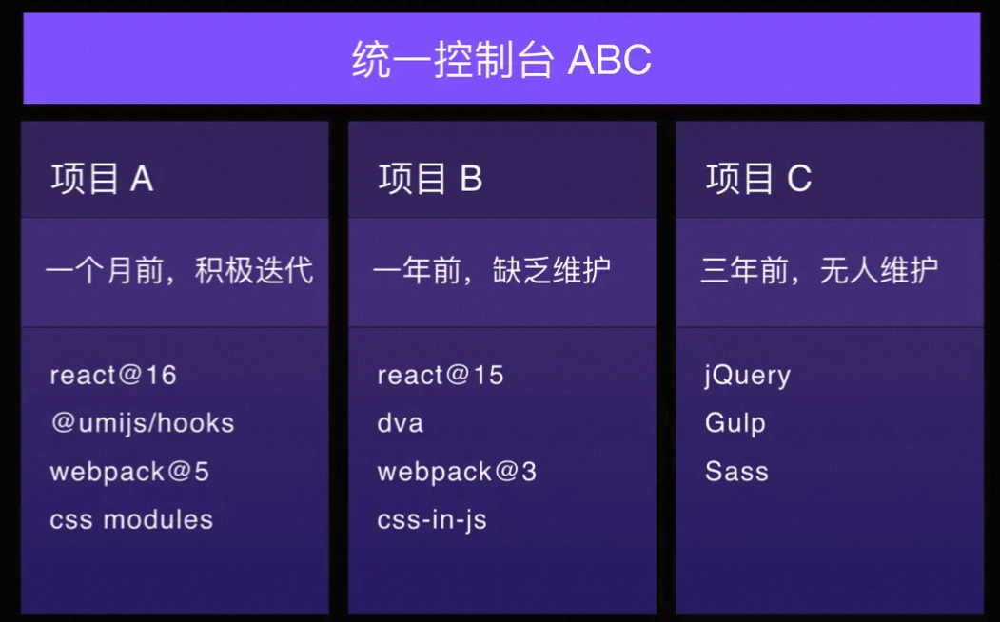

# 微前端的概述

## 产生的背景：

1、业务的发展，曾经一个简单的应用变得越来越复杂

2、技术栈的更替，旧技术开发效率逐渐变得低下，开发体验越来越差，维护成本越来越高

## 为什么不适用iframe

- iframe的问题

1、URL浏览器刷新 iframe url 状态丢失， cookie不共享、后退前进按钮无法使用

2、UI 不同步，DOM 结构不共享

3、每次子应用进入都是一次浏览器上下文重建、资源重新加载的过程

4、每次打开白屏时间太长，对于SPA应用来说无法接受

- 技术栈的隔离，部署互不影响的同时也能够享受单页应用页面切换跳转的体验

## 微前端的设计
- 技术栈无关
不限制子应用的技术栈，可以将不同技术栈的应用进行合并

- 独立开发部署
每一个子应用的开发部署是互不相关的

- 独立运行
js, css相互隔离，互不影响