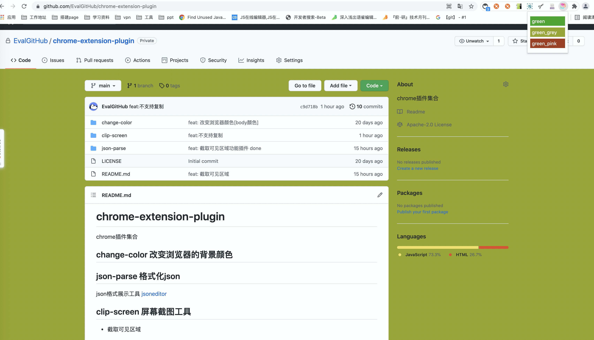
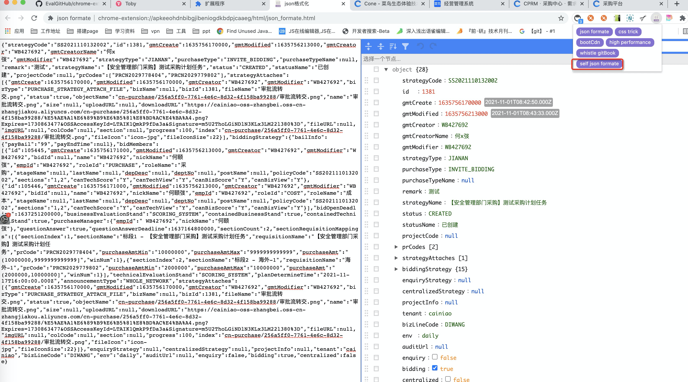
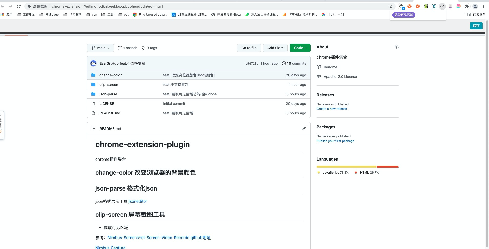

# chrome插件开发

浏览器插件支持js, css, html 所以对于前端同学来讲，基本已经不存在技术上的难点，剩下的就是了解下插件
开发的规则&知识点

## manifest.json
> 这个文件是插件的启动文件，必须存在

常见配置如下：
```
{
  "name": "屏幕截图", // 插件名字
  "version": "1.0", // 当前插件版本
  "description": "屏幕截图", 
  "manifest_version": 2, // chrome的规则会不断的更新，2表示使用的第二版，当前最新的是3 [2021/11/7]
  // 插件开发中需要使用的操作权限
  "permissions": [ "*://*/*", "\u003Call_urls>", "downloads", "clipboardWrite", "clipboardRead", "tabs", "activeTab", "storage", "unlimitedStorage", "contextMenus", "identity", "desktopCapture", "tabCapture" ],
  "short_name": "screen capture",
  # 核型功能模块
  "background": {
    "scripts": ["js/background.js"]
  },
  // 图标 浏览器上
  "browser_action": {
    "default_popup": "popup.html",
    "default_title": "屏幕截图",
    "default_icon": {
      "16": "images/icon.png",
      "32": "images/icon.png",
      "48": "images/icon.png",
      "128": "images/icon.png"
    }
  },
  // 插件市场的图片
  "icons": {
		"16": "images/icon.png",
		"48": "images/icon.png",
		"128": "images/icon.png"
	}
}
```

## 实现的实际案例

当前实现了三个案例

- change-color 屏幕换色 入门级



- json-parse json格式化



- clip-screen 屏幕截图



git地址：https://github.com/EvalGitHub/chrome-extension-plugin

> 不要在 chrome://extensions去调试你的页面，可能会失败；在一个正常域名下调试

参考链接：

[参考文章](https://www.cnblogs.com/liuxianan/p/chrome-plugin-develop.html) + [chrome插件完整教程实例](https://github.com/sxei/chrome-plugin-demo)

[官方文档](https://developer.chrome.com/docs/extensions/mv3/getstarted/) 、[gitbook](https://wizardforcel.gitbooks.io/chrome-doc/content/1.html)

[Chrome扩展程序开发](https://github.com/ecmadao/Coding-Guide/blob/master/Notes/%E5%89%8D%E7%AB%AF%E5%B7%A5%E7%A8%8B/Chrome%E6%89%A9%E5%B1%95%E7%A8%8B%E5%BA%8F%E5%BC%80%E5%8F%91.md)


